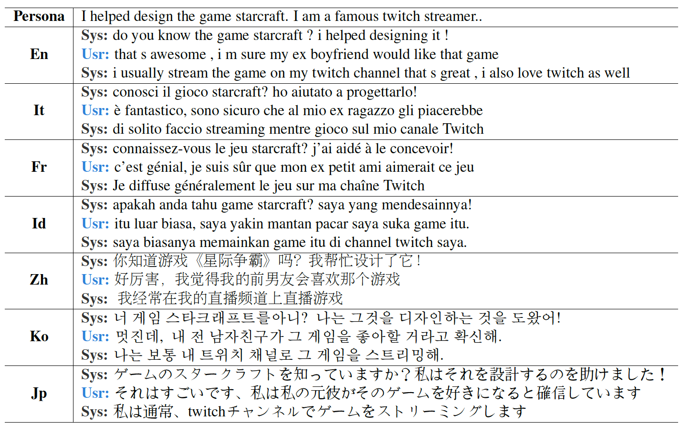
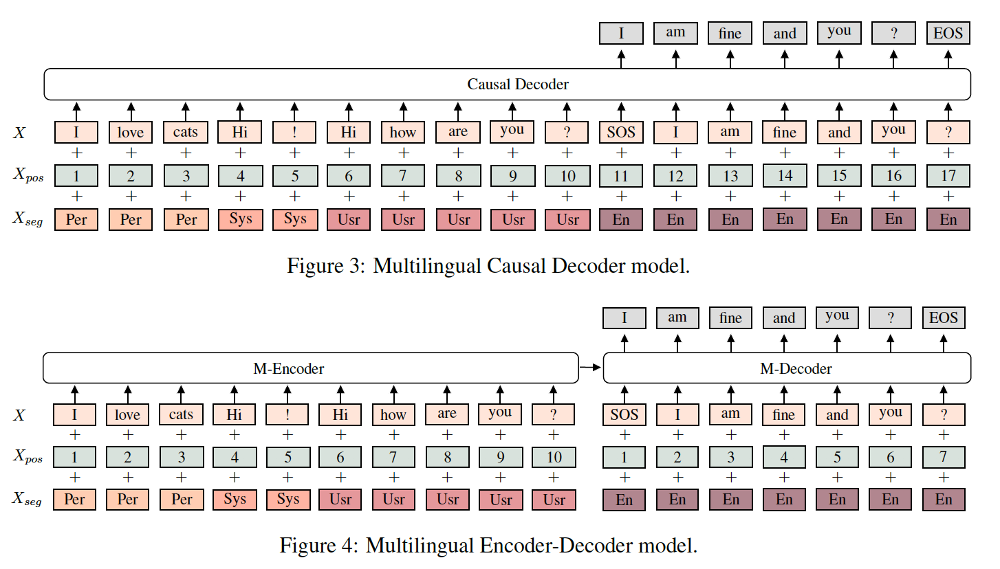

## XPersona: Evaluating Multilingual Personalized Chatbot
  

This is the source code of the paper:

**XPersona: Evaluating Multilingual Personalized Chatbot**. [[PDF]](https://aclanthology.org/2021.nlp4convai-1.10.pdf)

The paper has been presented at [NLP4ConvAI at EMNLP 2021 (Honorable Mention Paper)](https://sites.google.com/view/3rdnlp4convai/program?authuser=0). This code has been written using PyTorch. If you use source codes or datasets included in this toolkit in your work, please cite the following papers:

**XPersona**
<pre>
@inproceedings{lin2021xpersona,
  title={XPersona: Evaluating Multilingual Personalized Chatbot},
  author={Lin, Zhaojiang and Liu, Zihan and Winata, Genta Indra and Cahyawijaya, Samuel and Madotto, Andrea and Bang, Yejin and Ishii, Etsuko and Fung, Pascale},
  booktitle={Proceedings of the 3rd Workshop on Natural Language Processing for Conversational AI},
  pages={102--112},
  year={2021}
}
</pre>

**English PersonaChat**
<pre>
@article{zhang2018personalizing,
  title={Personalizing Dialogue Agents: I have a dog, do you have pets too?},
  author={Zhang, Saizheng and Dinan, Emily and Urbanek, Jack and Szlam, Arthur and Kiela, Douwe and Weston, Jason},
  journal={arXiv preprint arXiv:1801.07243},
  year={2018}
}
</pre>

## Dataset

XPersona dataset is an extension of the persona-chat [dataset](https://www.aclweb.org/anthology/P18-1205/).  Specifically, we extend the [ConvAI2](http://convai.io) to the other six languages: Chinese, French, Indonesian, Italian, Korean, and Japanese.

## Baselines

In this work, we provided multilingual and crosslingual trained baselines. See [multilingual](https://github.com/HLTCHKUST/Xpersona/tree/master/multilingual) and [crosslingual](https://github.com/HLTCHKUST/Xpersona/tree/master/crosslingual) folder for more details.

## Acknowledgement
This repository is implemented using [**Huggingface**](https://github.com/huggingface/transformers) codebase.

